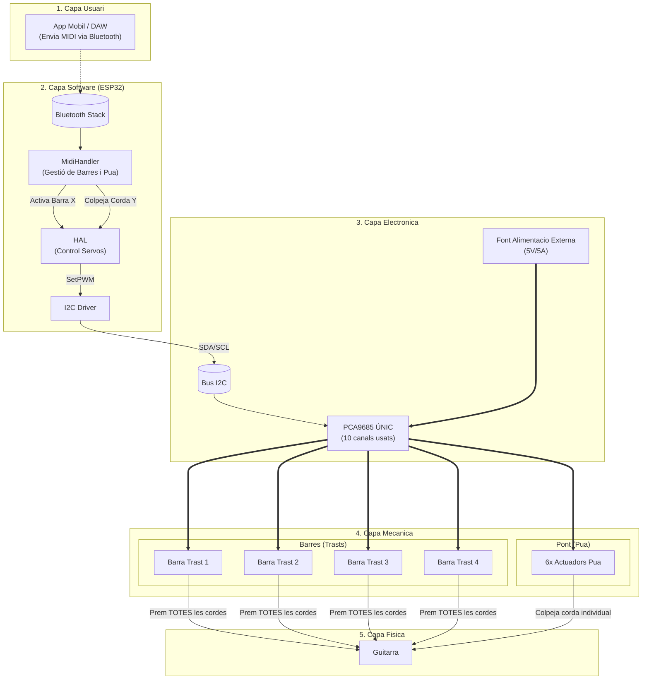
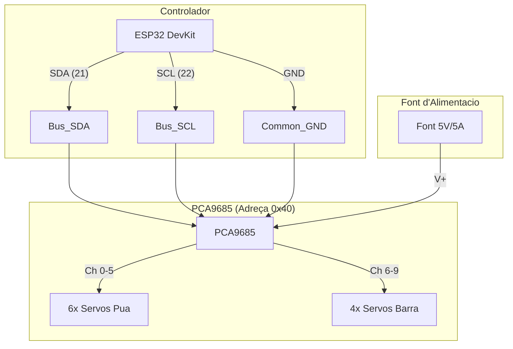
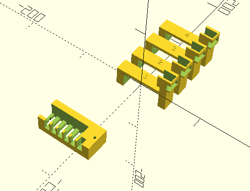

# Firmware Robot Guitarrista (Versió "Barra de Trasts")

Firmware per a ESP32 per controlar un robot que toca la guitarra via MIDI per Bluetooth (BLE).
**Aquesta versió utilitza una arquitectura simplificada de 10 motors (Barres de Trast).**

## Visió Global del Sistema

## Arquitectura Simplificada (10 Motors)
Aquest disseny utilitza el concepte de **"Cejilla Mòbil"**:
*   **4 Motors per als Trasts**: Cada motor mou una barra que prem el Trast 1, 2, 3 o 4 de **totes les cordes alhora**.
*   **6 Motors per a les pues**: Un per cada corda per fer-la sonar.
*   **Limitació**: Totes les cordes que sonin han de fer-ho en el mateix trast (o a l'aire si cap barra està activa). És ideal per "Power Chords" o melodies simples, però no pot fer acords complexos amb dits a diferents trasts.

## Muntatge del Hardware

1.  **Microcontrolador**: ESP32 DevKit.
2.  **Controlador**: **1x** Placa PCA9685 (Adreça 0x40 per defecte).
3.  **Connexions PCA9685**:
    -   **Canals 0-5**: Motors de Pua (Corda 1 a 6).
    -   **Canals 6-9**: Motors de Barra (Trast 1 a 4).

### Esquema Elèctric

## Compilació i Càrrega

1.  Obre la carpeta a VS Code (PlatformIO).
2.  Build & Upload.

## Dependències
- Adafruit PWM Servo Driver
- BLE-MIDI

# Disseny 3D
