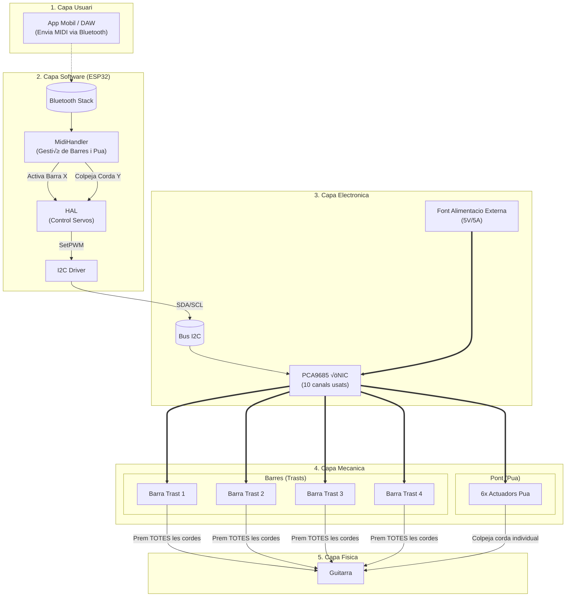
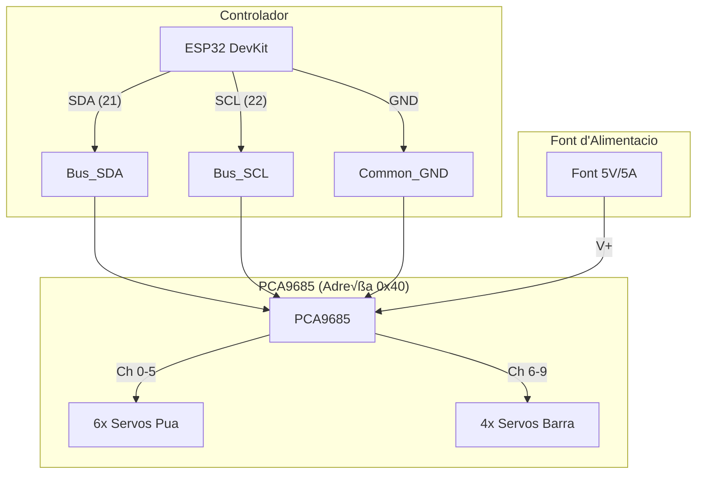

# Firmware Robot Guitarrista (Versió "Barra de Trasts")

Firmware per a ESP32 per controlar un robot que toca la guitarra via MIDI per Bluetooth (BLE).
**Aquesta versió utilitza una arquitectura simplificada de 10 motors (Barres de Trast).**

## Visió Global del Sistema

```mermaid
graph TD
    subgraph "1. Capa Usuari"
        DAW["App Mobil / DAW<br>(Envia MIDI via Bluetooth)"]
    end

    subgraph "2. Capa Software (ESP32)"
        BLE[("Bluetooth Stack")]
        Logic["MidiHandler<br>(Gestió de Barres i Pua)"]
        HAL["HAL<br>(Control Servos)"]
        Driver["I2C Driver"]
        
        DAW -.-> BLE
        BLE --> Logic
        Logic -- "Activa Barra X" --> HAL
        Logic -- "Colpeja Corda Y" --> HAL
        HAL -- "SetPWM" --> Driver
    end

    subgraph "3. Capa Electronica"
        PSU["Font Alimentacio Externa<br>(5V/5A)"]
        Bus[("Bus I2C")]
        PCA1["PCA9685 √öNIC<br>(10 canals usats)"]

        Driver -- "SDA/SCL" --> Bus
        Bus --> PCA1
        PSU ====> PCA1
    end

    subgraph "4. Capa Mecanica"
        direction TB
        subgraph "Barres (Trasts)"
            Bar1["Barra Trast 1"]
            Bar2["Barra Trast 2"]
            Bar3["Barra Trast 3"]
            Bar4["Barra Trast 4"]
        end
        subgraph "Pont (Pua)"
            Pluckers["6x Actuadors Pua"]
        end
    end

    subgraph "5. Capa Fisica"
        GuitarStrings["Guitarra"]
    end

    PCA1 ====> Bar1 & Bar2 & Bar3 & Bar4
    PCA1 ====> Pluckers
    Bar1 & Bar2 & Bar3 & Bar4 -- "Prem TOTES les cordes" --> GuitarStrings
    Pluckers -- "Colpeja corda individual" --> GuitarStrings
```

## Arquitectura Simplificada (10 Motors)
Aquest disseny utilitza el concepte de **"Cejilla Mòbil"**:
*   **4 Motors per als Trasts**: Cada motor mou una barra que prem el Trast 1, 2, 3 o 4 de **totes les cordes alhora**.
*   **6 Motors per a les pues**: Un per cada corda per fer-la sonar.

## Estratègia Musical (Com tocar acords?)

### ⚠️ La Limitació
El sistema de barres rectes implica que **totes les notes actives han d'estar al mateix trast** (o a l'aire).
*   Això fa **impossible** tocar acords oberts estàndards com el Do Major (C) o el Sol (G) amb afinació normal (EADGBE), ja que requereixen dits en trasts diferents (0, 1, 2, 3...) alhora.

### ✅ La Solució: Afinació Oberta (Open Tuning)
Per treure el màxim partit al robot, es recomana canviar l'afinació de la guitarra a **Open E** o **Open G**.
En una afinació oberta, tocar totes les cordes a l'aire ja fa un acord major.
*   **Barra Aixecada (0)**: Acord Base (Ex: Mi Major).
*   **Barra Trast 1**: Acord Fa Major.
*   **Barra Trast 2**: Acord Fa# Major.

Així pots tocar cançons senceres només movent la barra amunt i avall!

## Muntatge del Hardware

1.  **Microcontrolador**: ESP32 DevKit.
2.  **Controlador**: **1x** Placa PCA9685 (Adreça 0x40 per defecte).
3.  **Connexions PCA9685**:
    -   **Canals 0-5**: Motors de Pua (Corda 1 a 6).
    -   **Canals 6-9**: Motors de Barra (Trast 1 a 4).

### Esquema Elèctric

```mermaid
graph TD
    subgraph Power ["Font d'Alimentacio"]
    PSU[Font 5V/5A]
    end

    subgraph Controller [Controlador]
    ESP32[ESP32 DevKit]
    ESP32 -- "SDA (21)" --> Bus_SDA
    ESP32 -- "SCL (22)" --> Bus_SCL
    ESP32 -- "GND" --> Common_GND
    end

    subgraph Driver ["PCA9685 (Adreça 0x40)"]
    PCA[PCA9685]
    Bus_SDA --> PCA
    Bus_SCL --> PCA
    Common_GND --> PCA
    PSU -- "V+" --> PCA
    PCA -- "Ch 0-5" --> Plucks[6x Servos Pua]
    PCA -- "Ch 6-9" --> Bars[4x Servos Barra]
    end
```

## Compilació i Càrrega

1.  Obre la carpeta a VS Code (PlatformIO).
2.  Build & Upload.

## Dependències
- Adafruit PWM Servo Driver
- BLE-MIDI

# Disseny 3D

## 🌐 Configuració WiFi i Afinació

El robot crea el seu propi punt d'accés WiFi per configurar-lo sense cables.

1.  Connecta't amb el mòbil/portàtil a la WiFi **GuitarBot_Setup**.
2.  La contrasenya és: **12345678**.
3.  Obre el navegador i ves a: **http://192.168.4.1**

Des d'allà podràs canviar en temps real entre **Standard**, **Open E**, **Open G**, etc. sense haver de tornar a carregar el codi.
