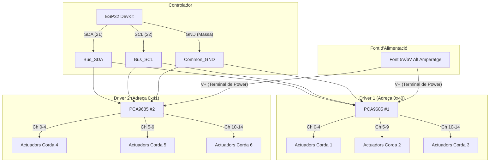

# Firmware Robot Guitarrista - Guia Pas a Pas

Aquest firmware converteix el teu ESP32 en un receptor MIDI Bluetooth que controla solenoides o servos per tocar una guitarra física.

## Muntatge del Hardware
1.  **Microcontrolador**: ESP32 DevKit.
2.  **Controladors (Drivers)**: 2x plaques PCA9685 PWM (connectades via I2C).
    -   **Controlador 1 (Adreça 0x40)**: Controla les Cordes 1, 2 i 3.
    -   **Controlador 2 (Adreça 0x41)**: Controla les Cordes 4, 5 i 6.
    -   *Nota*: Has de soldar el pont (jumper) d'adreça a a la segona placa PCA9685 per canviar-la de 0x40 a 0x41 (normalment es diu pont A0).

3.  **Esquema de connexió (Per Corda)**:
    -   Cada grup de corda té 5 canals assignats:
        -   Canal 0: **Pua/Dits** (Servo/Solenoide al pont per fer sonar la corda)
        -   Canal 1: **Trast 1**
        -   Canal 2: **Trast 2**
        -   Canal 3: **Trast 3**
        -   Canal 4: **Trast 4**
    -   *Exemple*: El "Dits" de la Corda 1 és al Controlador 1, Canal 0. El Trast 1 de la Corda 1 és al Controlador 1, Canal 1.

## Esquema Elèctric (Diagrama de Cablejat)

> [!WARNING]
> **Alimentació Crítica**: No alimentis els Servos/Solenoides directament des de l'ESP32. Utilitza una font d'alimentació externa d'alt amperatge (5V o 6V, idealment 5A o més) connectada als terminals de cargol de les plaques PCA9685.

## Compilació i Càrrega
1.  Obre aquesta carpeta a VS Code amb l'extensió **PlatformIO** instal·lada.
2.  Fes clic a la icona de **Build** (cap d'alienígena -> Build).
3.  Connecta l'ESP32 per USB i fes clic a **Upload**.

## Ús
1.  Engega l'ESP32.
2.  Obre una App MIDI (p. ex. GarageBand a iOS, o "MIDI BLE Connect" a Android).
3.  Busca dispositius Bluetooth. Hauries de veure **"GuitarBot_ESP32"**.
4.  Connecta't.
5.  Envia notes MIDI (Rang E2 a E4).
    -   El Monitor Sèrie (a 115200 baudis) mostrarà missatges com: `NoteOn: 64 -> String 1, Fret 0`.

## Afinació
-   El mapa per defecte assumeix l'afinació estàndard de guitarra:
    -   Corda 6 (E Greu) = Nota 40
    -   Corda 5 (A) = Nota 45
    -   ...
    -   Corda 1 (E Agut) = Nota 64
-   Si fas servir una altra afinació, modifica `STRING_BASE_NOTES` a l'arxiu [src/MidiHandler.cpp](file:///c:/AESS_Projectes/guitar_robot/src/MidiHandler.cpp).

# Disseny actual en 3D (veure design)

